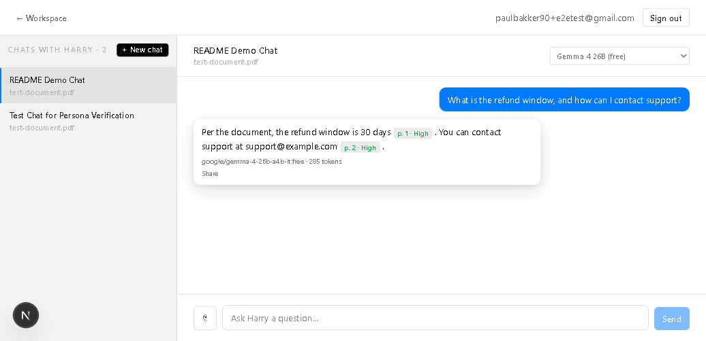

# Turing College — Building with AI / Claude Code

A Next.js + Supabase project built across three Turing College sprints. It started as a single-user, browser-only document manager (Sprint 1) and grew into six apps sharing one Supabase project (Sprints 2–3) — two of which, **Chat** and **Harry**, are AI-native: strip the model calls out of either one and there's nothing left but a form with nowhere to send its input.

## What this app does

Six apps live under one sign-in flow (Supabase Auth) and one Supabase project:

- **Doc manager** (`/docs`) — the original, still-public, `localStorage`-only document workspace from Sprint 1. No AI, no login.
- **Notes app** (`/notes`) — collections, tags, full-text search, pinning, archiving, and read-only link sharing. Signed-in only, one row per user enforced by RLS.
- **Personal Journal** (`/journal`) — one entry per calendar day, full-text search, one optional image. Signed-in only, zero anonymous access anywhere.
- **Chat** (`/chat`) — **AI-native.** A single, persistent, streaming conversation per user, backed by OpenRouter. It can search your own Notes via a tool call when a question calls for it, and can see an attached image.
- **Harry** (`/harry`) — **AI-native, and the centerpiece of this project.** Upload a PDF, ask it expert questions, and every answer is grounded strictly in that document: a page citation and a self-rated confidence per claim, produced only after a hidden self-validation pass re-checks the draft against the same retrieved pages. Multiple independent, named chats per user, each scoped to its own uploaded document. Answers can be shared read-only via a link.
- **Workspace** (`/workspace`) — a signed-in landing area proving out Supabase Auth (email/password, Google, GitHub).

**Why Chat and Harry are the core of this project, not a feature bolted on:** every other app in this repo is a CRUD form with a database behind it. Chat and Harry are the two apps where an LLM call is the actual work being done — mandatory retrieval, a hidden self-check, streaming, multimodal input, and per-user model choice all exist because there's a real model in the loop making real decisions about what to say and how confident to be. See [`docs/REFLECTION-harry.md`](docs/REFLECTION-harry.md) for how that was built and what broke along the way.

## Screenshot



Harry answering a real question against an uploaded PDF — page citations, per-claim confidence, and the model/token-usage line are all visible, all from a real OpenRouter call made server-side.

## Live deployment

**[https://temp-app-weld.vercel.app](https://temp-app-weld.vercel.app)**

Deployed via the Vercel CLI (this project's `vercel.json` has `git.deploymentEnabled: false`, so pushes to GitHub do **not** auto-deploy — a fresh `vercel --prod` is required to update it). If the URL above doesn't load, Vercel's own automatic DDoS/traffic mitigation may be temporarily active on the deployment; the app itself is unaffected, and running it locally (below) always works.

## Running locally

```bash
npm install
npm run dev
```

Opens at [http://localhost:3000](http://localhost:3000).

### Environment variables

Create a `.env.local` file in the project root with:

```
NEXT_PUBLIC_SUPABASE_URL=...
NEXT_PUBLIC_SUPABASE_PUBLISHABLE_KEY=...
OPENROUTER_API_KEY=...
```

| Variable | Where to find it |
|---|---|
| `NEXT_PUBLIC_SUPABASE_URL` | Supabase dashboard → your project → **Project Settings → Data API** |
| `NEXT_PUBLIC_SUPABASE_PUBLISHABLE_KEY` | Supabase dashboard → your project → **Project Settings → API Keys** (the **publishable/anon** key — never the `service_role`/secret key, which does not belong in this app at all) |
| `OPENROUTER_API_KEY` | [openrouter.ai](https://openrouter.ai) → sign in → **Keys** → create a key. Server-side only — never exposed to the browser, never prefixed `NEXT_PUBLIC_` |

You'll also need every migration in `supabase/migrations/` applied to that Supabase project (via `npx supabase db push --linked` or the dashboard SQL editor) — they create every table, RLS policy, and Storage bucket every app in this repo depends on.

Optional, only needed to run the Playwright suite (`npm run test:e2e`):

```
E2E_TEST_EMAIL=...
E2E_TEST_PASSWORD=...
```

A dedicated test account, not a real user — see `CLAUDE.md`'s "E2E tests" section for why it's seeded via SQL rather than the real sign-up form.

## Features

### Doc manager (`/docs`) — Sprint 1
Create/edit/delete with autosave, unique per-document URLs, markdown preview, tags, starring, dark/light theme, word count, export/import as JSON, history/snapshots, soft delete + trash, command palette (`Ctrl+K`), drag-and-drop folders.

### Notes app (`/notes`) — Sprint 2
Collections (create, rename, drag-to-reorder), colour-coded tags with multi-select filtering, pin/archive, server-side full-text search with recent-search suggestions, one image per note via Supabase Storage, read-only collection sharing via `/shared/[token]`, export a note as Markdown.

### Authentication (`/workspace`) — Sprint 2
Email/password, Google OAuth, and GitHub OAuth sign-in; password reset via email; server-side session verification (`getUser()`, never `getSession()`) protecting every page under `/workspace`, `/notes`, `/journal`, `/chat`, and `/harry`.

### Personal Journal (`/journal`) — Sprint 3
One entry per calendar day per user (enforced at the database level), full-text search, one optional image per entry. Deliberately narrower in scope than Notes — no tags, no collections, no sharing.

### Chat (`/chat`) — Sprint 3, AI-native
- A persistent, single conversation per user; the full history is replayed to the model every turn, which is how it "remembers" earlier turns.
- **Token-by-token streaming**, hand-rolled over Server-Sent Events (no AI SDK) via a `POST /api/chat` Route Handler.
- **Model-driven note search**: the model decides for itself, via a native tool call, whether a question needs to search your Notes — and can rewrite and retry the query if the first search looks weak. General-knowledge questions get answered directly, no search at all.
- **Per-user model choice** — Haiku 4.5, Sonnet 5, or Gemini 2.5 Flash — persisted per user, threaded through every model call.
- **Multimodal input** — attach an image to a message; the model sees it directly for that turn.
- **Model + token-usage transparency** — every assistant reply shows which model answered and how many tokens it used.

### Harry, the Intelligent Doc Reviewer (`/harry`) — Sprint 3, AI-native (core feature)
- Upload a PDF (parsed, chunked, and embedded page-by-page on upload); ask it expert questions about that document specifically.
- **Mandatory, automatic retrieval-grounded answers** — unlike Chat's optional tool call, Harry is never given the option to answer without the document's own text in front of it.
- **Per-claim page citation and self-rated confidence** (`[p. N; confidence: High|Medium|Low]`), rendered as inline badges.
- **Hidden self-validation pass** — a second, unstreamed model call re-checks every claim in the draft against the same retrieved pages before anything is shown to the user or saved. Only the validated answer is ever persisted.
- **Multiple independent, named chats per user**, each scoped to its own uploaded document; full per-chat conversational memory.
- **Per-user model choice**, including a genuinely free ($0) option (Gemma 4 26B) alongside Haiku 4.5 and Gemini 2.5 Flash — Harry deliberately doesn't offer Sonnet, since document QA doesn't need its extra reasoning cost the way general chat might.
- **Multimodal input** — attach an image to a question; both the draft *and* the hidden validation call see it, while retrieval itself stays text-query-only.
- **Shareable answers** — a "Share" button on any of Harry's replies produces a public, read-only, text-only link (`/harry-shared/[token]`); the source PDF and its embedded chunks are never exposed, only that one answer's text.

## Stack

- [Next.js 16](https://nextjs.org/docs) — App Router
- TypeScript
- Tailwind CSS v4
- Supabase (Postgres, Auth, Storage, pgvector) for every app except the doc manager
- [OpenRouter](https://openrouter.ai) for LLM chat completions and embeddings — `anthropic/claude-haiku-4.5` / `anthropic/claude-sonnet-5` / `google/gemini-2.5-flash` / `google/gemma-4-26b-a4b-it:free` for chat, `openai/text-embedding-3-small` for embeddings

## Project structure

```
app/
  docs/                     # doc manager (localStorage, Sprint 1)
  notes/                    # Supabase-backed notes app (Sprint 2)
  journal/                  # Supabase-backed daily journal (Sprint 3)
  chat/                     # single persistent AI conversation (Sprint 3, AI-native)
  harry/, harry-shared/     # AI doc reviewer + its public share route (Sprint 3, AI-native)
  workspace/, login/, signup/, forgot-password/, reset-password/  # Supabase Auth
  api/chat/                 # streaming Route Handler for /chat
  components/               # per-app sidebars, editors, ModelSelector.tsx, ...
  lib/
    documents.ts, db.ts, journal.ts     # doc manager / notes / journal data access
    chat.ts, chat-actions.ts, chat-shared.ts        # /chat data access + server actions
    harry.ts, harry-actions.ts, harry-ingest.ts     # /harry data access, actions, PDF ingestion
    ai.ts                    # the single OpenRouter connection point for the whole app
    settings.ts              # per-user model preference
    auth.ts                  # all Supabase Auth calls
    supabase/                # client/server/middleware wrappers
supabase/
  migrations/                # numbered SQL migrations (schema, RLS, Storage, RPCs)
docs/
  REFLECTION.md, REFLECTION-journal.md, REFLECTION-harry.md   # architectural decisions and lessons learned, per app
  Reflections.md             # Sprint 3 reflections, consolidated
  ai-code-review-pr9-harry.md   # ai-code-reviewer findings for the Harry PR
  screenshots/                # README screenshots
  superpowers/specs/, superpowers/plans/   # design specs and implementation plans
CLAUDE.md                    # project conventions and architecture notes for Claude Code (Sprint 3 scope)
```
